 

  

  

About Me

I am a Mid-Level Software Developer at PDA Soluções with more than six years of professional experience building, maintaining and evolving enterprise software for the retail industry.

My career has progressed from a development internship to a mid-level engineering position, giving me experience across the complete software lifecycle: requirements analysis, implementation, debugging, testing, production support, technical documentation and communication with customers and internal teams.

My core expertise is centered on C#, .NET, SQL, Oracle and full stack product development, with hands-on experience creating business-critical solutions for inventory management, receiving operations, pricing, billing, stock control, picking and system integrations.

I approach software development with a product engineering mindset, balancing maintainability, performance, security, usability and business impact. I also contribute to technical leadership by supporting other developers, producing internal documentation and coordinating the support operation for the company's retail division.

I am currently expanding my expertise in Artificial Intelligence and AI-assisted software engineering, with a focus on LLMs, Retrieval-Augmented Generation, Model Context Protocol and Spec-Driven Development.

Open To

Software engineering and full stack development opportunities

Enterprise systems and SaaS product development

AI-powered applications and intelligent automation

Technical challenges involving scalability, architecture and integrations

Collaboration with product-oriented engineering teams

Tech Stack

Programming Languages

 

Spoken Languages

Frontend

Backend & Databases

 

Cloud, DevOps & Tooling

 

AI / ML Expertise

Domain

Proficiency

Details

Large Language Models

Developing

Studying LLM architecture, integration patterns and practical applications in enterprise software.

Retrieval-Augmented Generation

Developing

Exploring knowledge retrieval, contextual grounding and AI responses based on private business data.

Model Context Protocol

Developing

Building knowledge around MCP servers, tools, resources and AI-to-system integration.

AI-Assisted Engineering

Intermediate

Applying AI tools to analysis, documentation, architecture, debugging and development workflows.

Spec-Driven Development

Developing

Exploring structured specifications to guide AI-assisted implementation and reduce ambiguity.

Intelligent SaaS Products

Intermediate

Designing a multi-tenant financial management platform with integrated artificial intelligence.

Featured Projects

<strong>SaaS WMS — Enterprise Retail Management Platform</strong>

 

A business-critical warehouse and retail operations platform developed to support inventory, receiving, price reduction, billing, stock management, picking and integrations between enterprise systems.

Category

Details

Stack

React, C#, .NET Core, SQL

Scale

More than 50 customers, typically operating between 30 and 150 branches

Performance

High-performance workflows designed for large operational volumes

Security

Enterprise-grade access control, data validation and protected business operations

Impact

Essential platform for inventory and retail operation management, established as a market reference

Repository

Private commercial repository

Engineering Overview

The platform supports complex retail workflows where availability, data consistency and operational reliability are essential. Its modules cover multiple stages of the supply chain and store operation lifecycle, connecting inventory data, receiving processes, pricing operations, billing routines, stock management and picking activities.

My contributions include feature development, production issue resolution, N3 support, database analysis, REST API development, technical documentation and continuous improvement of systems used by customers with dozens or hundreds of stores.

The project requires continuous attention to scalability, business rules, SQL performance, integration reliability, traceability and safe deployment in enterprise environments.

<strong>AI-Powered Multi-Tenant Financial Management Platform</strong>

 

A multi-tenant SaaS platform under development for centralized corporate financial management, enhanced by artificial intelligence to assist with analysis, automation and business decision-making.

Category

Details

Stack

Full stack architecture, APIs, relational databases and AI integrations

Scale

Designed for multiple companies, isolated tenants and scalable business operations

Performance

Architecture focused on efficient data access and sustainable application growth

Security

Tenant isolation, controlled authorization and secure handling of financial information

Impact

Intended to reduce manual financial operations and provide intelligent business insights

Repository

Private project

Engineering Overview

The platform is being designed around a multi-tenant architecture capable of serving multiple organizations while maintaining secure data isolation and consistent business rules.

The solution explores practical applications of LLMs, RAG and intelligent automation to improve financial control, organize operational data and provide contextual assistance to business users.

The project combines product engineering, SaaS architecture, financial workflows, artificial intelligence and scalable application design.

Professional Experience

Mid-Level Software Developer · PDA Soluções

February 2023 — Present

Promoted from Junior Developer to Mid-Level Developer, taking broader responsibility for enterprise software development, production support, technical documentation and team guidance.

Scope of Work

Develop and maintain features for enterprise retail software.

Investigate and resolve production bugs and complex technical incidents.

Provide N3 support for business-critical customer operations.

Create technical documentation for developers and internal teams.

Coordinate the support operation for the company's retail division.

Build and maintain REST APIs and system integrations.

Work with cloud infrastructure and containerized environments.

Support systems involving inventory, receiving, billing, pricing and stock management.

Skills

 

Junior Software Developer · PDA Soluções

January 2021 — February 2023

Promoted from Development Analyst to Junior Software Developer, working directly on product evolution, production maintenance and advanced technical support.

Scope of Work

Developed new features for the company's retail software.

Corrected bugs across backend, database and web interfaces.

Provided N3 support for customer-reported incidents.

Analyzed business rules and existing application behavior.

Maintained SQL and Oracle database routines.

Contributed to frontend interfaces using HTML and CSS.

Skills

 

Development Analyst · PDA Soluções

March 2020 — December 2020

Hired as a full-time Development Analyst after completing the internship program, supporting customers and maintaining enterprise applications.

Scope of Work

Investigated source code and identified software defects.

Corrected bugs in enterprise applications.

Created technical documentation and testing evidence.

Communicated with customers regarding incidents and resolutions.

Supported SQL and Oracle database operations.

Participated in software maintenance and support workflows.

Skills

 

Software Development Intern · PDA Soluções

November 2019 — February 2020

Completed a four-month development internship focused on software engineering fundamentals and the company's service delivery workflow.

Scope of Work

Studied the company's development processes and technologies.

Produced technical reports describing development activities.

Learned the fundamentals of C# and .NET Core.

Supported internal learning and software analysis activities.

Built foundational knowledge of enterprise development workflows.

Skills

Achievements

Recognition

Details

Career Progression

Progressed from Software Development Intern to Mid-Level Software Developer at PDA Soluções.

Enterprise Software Impact

Contributed to software used by more than 50 customers with operations ranging from approximately 30 to 150 branches.

Technical Leadership

Responsible for coordinating support activities for the company's retail division.

Business-Critical Systems

Develops and maintains systems essential to inventory, receiving, billing, pricing and stock operations.

Knowledge Sharing

Produces technical documentation to support developers and improve internal engineering workflows.

Certifications

GitHub Insights

 

---

Contribution Snake

<picture>
  <source media="(prefers-color-scheme: dark)" srcset="./assets/github-contribution-grid-snake-dark.svg">
  <source media="(prefers-color-scheme: light)" srcset="./assets/github-contribution-grid-snake.svg">
  
</picture>

Current Focus

learning:
  - Large Language Models
  - Retrieval-Augmented Generation
  - Model Context Protocol
  - Artificial Intelligence
  - Spec-Driven Development

building:
  - Multi-tenant financial management SaaS
  - AI-powered enterprise applications
  - Scalable business management solutions

exploring:
  - Web security
  - AI engineering
  - Intelligent automation
  - Enterprise software architecture

open_to:
  - New technologies
  - Software engineering challenges
  - AI-powered product development
  - Enterprise SaaS opportunities

Connect

“Engineering reliable software that transforms complex business operations into scalable digital products.”

